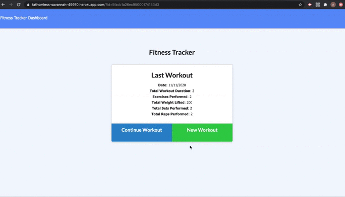

# Fitness Tracker Hw
> An application that creates and tracks daily workouts by logging the multiple exercises that are put in for that day into a database. In addition, you can view the page of the last seven workouts and their summary.

## Table of contents
* [General info](#general-info)
* [Link](#Link)
* [Screenrecording](#screenrecording)
* [Setup](#setup)
* [Technologies](#Technologies)
* [Status](#status)

## Link
https://fathomless-savannah-49970.herokuapp.com/

## Screenrecording

## Setup

To get this project up and running follow the steps bellow.

1. Navigate to the main page of the repository
2. Under the repository name, click Clone or download
3. In the Clone with HTTPSs section, click the copy
4. Open Terminal
5. Change the current working directory to the location where you want the cloned directory to be made.
6. Type ‘git clone’ and then paste the URL you copied
	- $ git clone https://github.com/aidabyte/Fitness-Tracker-Hw.git
7. Press Enter. Your local clone will be created.

## Technologies
1. Node js
2. Express
3. Mongodb
4. Mongoose
5. Heroku
6. Html
7. CSS

## Status
Project is: _in progress_ because I am still learning.
